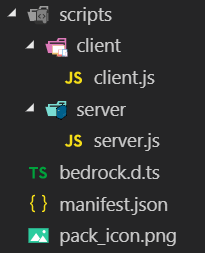
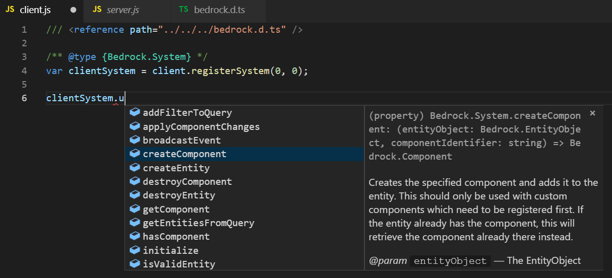

<h1 align="center">Bedrock Typings</h1>
<h2>TypeScript definitions for the Minecraft Bedrock Edition Scripting API</h2>

This allows you to have code autocompletion in modern code editors (like Visual Studio Code) when working with the Minecraft Bedrock Edition Scripting language. All definitions were derived from the [official wiki](https://minecraft.gamepedia.com/Bedrock_Beta_Script_Documentation#Entity_Queries).

## Usage

Download the `bedrock.d.ts` from this repo ([right click this and save-as](https://raw.githubusercontent.com/christopherwk210/bedrock-typings/master/bedrock.d.ts)) and put it into your current scripting project folder.

Your project structure may look something like this:
<p align="center">
  
</p>

Open up any script you want to use these typings in, and copy this into the very top line of that script:

```
/// <reference path="../../bedrock.d.ts" />
```
Each `../` represents going upwards one directory. Depending on your project structure, you may need to modify the path to correctly point to where you saved `bedrock.d.ts`.

Once that's done, add this **directly** above where you call `.registerSystem()` like this:
```js
/** @type {Bedrock.System} */
var clientSystem = client.registerSystem(0, 0);
```
or
```js
/** @type {Bedrock.System} */
var serverSystem = server.registerSystem(0, 0);
```

That's it! You may have to restart your editor for the changes to take effect. Now when you type `clientSystem.` you'll see autocomplete suggestions.

<p align="center">
  
</p>
